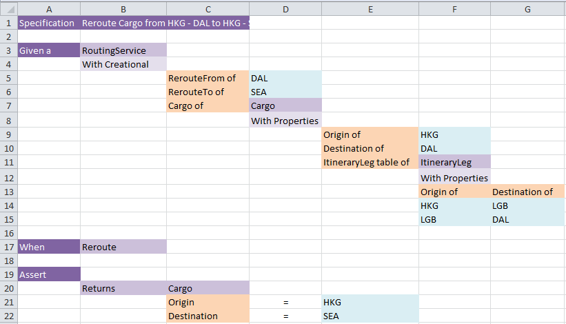

# Customer Tests Excel 

A framework to round trip NUnit to / from Microsoft Excel customer tests.

Born out of frustration using Fitnesse.

We are primarily a science and engineering company, and due to the calculation heavy nature of our work, none of the existing customer test frameworks are a good fit for us.

Advantages
- Tests are expressed in Microsoft Excel Spreadsheets, which our customers are familiar with, and which support any complexity of calculation
- Tests are run in C# via NUnit, and make use of existing tooling (which aids debugging, coverage, Continuous Integration etc)
- Automated refactoring can be done in C#, using existing tooling, and then the changes written back to Excel
- The NUnit tests are generated from Excel, so the two are guaranteed to be in sync

# Building

- RES.Specification.sln

# Example

The SampleTests and SampleSystemUnderTest projects are in the main solution (RES.Specification.sln), and are in the SampleTests and SampleSystemUnderTest directories. 

There is an example Excel test in SampleTests/ExcelTests/Rerouting.xlsx, which looks like this:

