# CustomerTestsExcel Excel Syntax

todo: add intro
todo: add some pictures
done: add links to sample tests
done: standardise "Enter" and "should be" "must be"

## Test Name

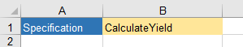

- The Name of a worksheet tab will become the name of the csharp file for the test.
- Cell A1 should be "Specification"
- Cell B2 is a description of the test

## Given

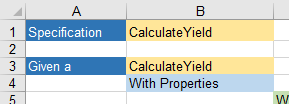

Cell A3 should be "Given a"

### Defining the Test Entity

Cell B3 is the start of the Test Entity, and defines it's name
Cell A3 should be "With Properties"

The properties should then follow, starting in C5

### Defining Primtive Properties

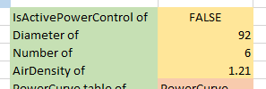

- Enter the Property Name, followed by " of" (this will translate to the property name in C#)
- The cell to the right should be the Property Value (strings should be enclosed in double quotes) 

See [Rerouting.xlsx](../SampleTests/ExcelTests/Rerouting.xlsx) for an example.

### Defining Complex Properties (something that has sub properties)

- Enter the Property Name, followed by " of" (this will translate to the property name in C#)
- The cell to the right should be the Property Type (this will translate to the property type in C#)
- The cell below should be "With Properties"
- Enter as many sub properties as desired, starting in the cell below right of "With Properties"

See [Rerouting.xlsx](../SampleTests/ExcelTests/Rerouting.xlsx) for an example.

### Defining list properties

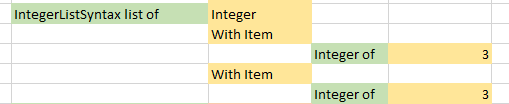

List properties can be Primitive or Complex

- Enter the Property Name, followed by " list of" (this will translate to the property name in C#)
- The cell to the right should be the Property Type (this will translate to the property type in C#)
- For the first item in the list, the cell below should be "With Item"
- Enter as many sub properties as desired, starting in the cell below right of "With Item"
- For further items in the list, enter "With Item" in the column to the right of the Name, and in the next available row (the one below the last property of the previous item in the list)

See [Anova.xlsx](../SampleTests/ExcelTests/Anova.xlsx) for an example.

### Defining table properties

Table properties can be Primitive or Complex. Both Table and List properties set up a list in C#, the only difference is in the Excel Syntax (tables are generally more concise, but cannot themselves contain tables, and if they have complex properties, they cannot round trip from C# to Excel).

- The first cell of a Table Property should be the Name, followed by "table of" (this will translate to the property name in C#)
- The cell to the right should be the Property Type (this will translate to the property type in C#)
- The cell below should be "With Properties"
- Enter Properties (Simple or Complex) in the row below, starting in the same column as With Properties and proceeding to the right.

#### Defining Table Primitive Properties

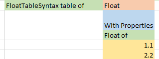

- Enter the Property Name, followed by " of"
- Enter a list of values in the columns below the name

See [Anova.xlsx](../SampleTests/ExcelTests/Anova.xlsx) and [Calculator.xlsx](../SampleTests/ExcelTests/Calculator.xlsx) for examples.

#### Defining Table Complex Properties

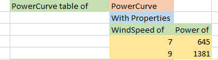

- Enter the Property Name, followed by " of"
- The cell below shoud be the Property Type
- The cell below should be "With Properties"
- Enter Sub Property Names in the row below, starting in the same column as With Properties and proceeding to the right. These must be Primitive Properties.
- Enter Sub Property Values in the columns below the names

See [Vermeulen Near Wake Length.xlsx](../SampleTests/ExcelTests/Vermeulen%20Near%20Wake%20Length.xlsx) for an example.

### Defining functions

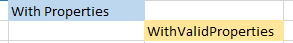

Defining functions is relatively rare, but can allow you to do complex things. This is obviously a double edged sword, so use with due awareness. Only parameterless functions are supported at the moment.

- Enter the Function Name

See [Misc.xlsx, functions sheet](../SampleTests/ExcelTests/Misc.xlsx) for an example.

## When

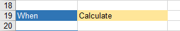

- "When" must be in column A, a row after the last item in the "Given" section (so that there is a blank row between the sections)
- The cell to the right of this should contain the name of the Action to perform. This is name of the C# function that will be called on the Test Entity during the test.

## Then

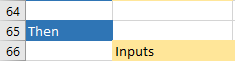

- "Then" must be in column A, a row after the last item in the "When" section (so that there is a blank row between the sections)
- The properties to test should start in the cell below and to the right.

### Defining Primtive Properties to test

- The first cell of a Primitive Property should be the Property Name (this will translate to the property name in C#)
- The cell to the right should be "="
- The cell to the right should be the Property Values

For numeric values, you can optionally set a tolerance

- The cell to the right should be "PercentagePrecision"
- The cell to the right should be a value between 0 and 1, representing the allowable diffence (percentage of the expected value) between the expected and actual values.

For string values, you can optionally set a format

- The cell to the right should be "StringFormat"
- The cell to the right should be a [C# string format](https://docs.microsoft.com/en-us/dotnet/api/system.string.format?view=netcore-3.1#System_String_Format_System_String_System_Object_), that becomes `string.Format("{0:" + format + "}", value)` during the test.

See [Calculator.xlsx](../SampleTests/ExcelTests/Calculator.xlsx) for an example,

### Defining Complex Properties to test (something that has sub properties)

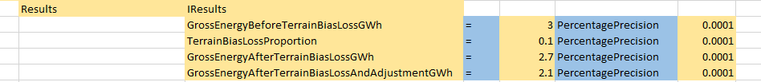

- Enter the Property Name (this will translate to the property name in C#)
- The cell to the right should be the Property Type (this will translate to the property type in C#)
- Enter as many sub properties as desired, starting in the cell below

See [Anova.xlsx](../SampleTests/ExcelTests/Anova.xlsx) for an example.

### Defining table properties to test

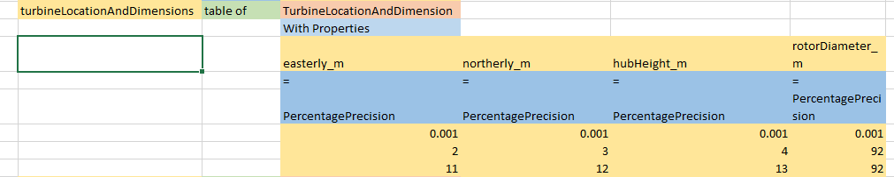

- Enter the Property Name, followed by "table of" (this will translate to the property name in C#)
- The cell to the right should be the Property Type (this will translate to the property type in C#)
- The cell below should be the "With Properties"

- Enter Simple Properties in the row below, starting in the same column as With Properties and proceeding to the right.

  - Enter the Property Name
  - Enter "=" in the cell below

- For numeric values, you can optionally set a tolerance

  - The cell below should be "PercentagePrecision"
  - The cell below should be a value between 0 and 1, representing the allowable diffence (percentage of the expected value) between the expected and actual values.

- For string values, you can optionally set a format

  - The cell below should be "StringFormat"
  - The cell below should be a [C# string format](https://docs.microsoft.com/en-us/dotnet/api/system.string.format?view=netcore-3.1#System_String_Format_System_String_System_Object_), that becomes `string.Format("{0:" + format + "}", value)` during the test.

- Enter Sub Property Values in the columns below

See [Vermeulen Near Wake Length.xlsx](../SampleTests/ExcelTests/Vermeulen%20Near%20Wake%20Length.xlsx) for an example.

