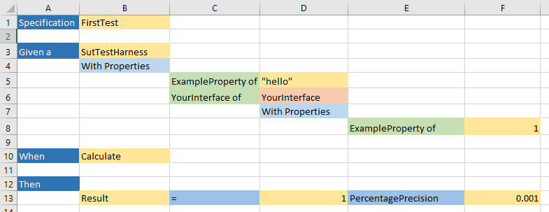

# Step by step guide

This is a comprehensive and simple step by step guide, that came from a demo of adding CustomerTestsExcel to an existing solution. The demo took around an hour, with discussion and questions.

It includes the following:
 - Adding a new Excel test
 - Generating code to setup properties on interfaces in your code
 - Calling your code during the test

## Steps

Copy the sample tests

 - Copy the SampleSystemUnderTest and SampleTests folders from the [scaffolding repo](https://github.com/resgroup/customer-tests-excel-scaffolding) and add them to the solution
 - Run the tests, which will confirm that the SampleTests compile, run and pass

Update GenerateTests.bat

 - Update SampleTests\GenerateTests.bat
   - The path to the nuget package will probably be different
   - The path in /assembliesUnderTest will be different (C# reflection requires the use of absolute paths) 
 - Run GenerateTests.bat, which will confirm that it works
 - Run the tests

Create a new test

 - Copy this [example test](https://github.com/resgroup/customer-tests-excel/blob/master/doc/step-by-step-guide.xlsx) (screenshot below) to SampleTests\ExcelTests
 - Setup some data for an interface in your code, instead of the *YourInterface* used in the example. The framework will prefix this with an "I" when matching interfaces in your code.
 - Maybe replace "Calculate" in the *When* section with a name appropriate to your context. This could be the name of a method on a class that you are testing, for example.
 - Maybe replace "Result" in the *Then* section with a name appropriate to your context. This could be the name of the thing that is returned from the system under test for example.
 - Create SampleTests\Setup\SutTestHarnessPartial.cs and write stubs for then *When* and *Then* parts of the test ("Result" and "Calculate()" in the example)
 - Run the tests, which should fail as we haven't implemented *When* and *Then* yet

 

Generate code for the new test 

 - Add a reference to your System Under Test project from SampleTests.csproj
 - Add the name of this project to the /usings parameter in GenerateTests.bat
 - Add the path of the built dll for this project (for example C:\YourSolution\YourProject\bin\debug\YourProject.dll") to the /assembliesUnderTest parameter in GenerateTests.bat
 - Add implementations for the *When* and *Then* parts SutTestHarnessPartial.cs to use your code
 - Run the tests, which should now pass
 
Polish

 - Everything should now work, but you may wish to rename "SutTestHarness" to something more appropriate for your context. It usually makes sense to name this after the System Under Test.

